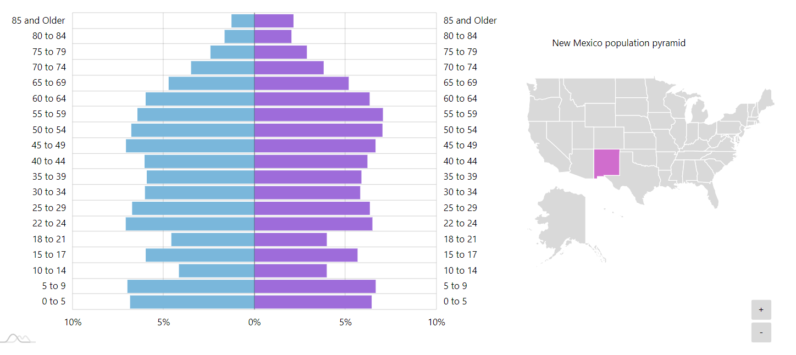
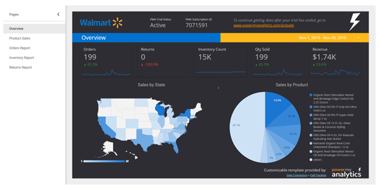

# Walmart Dashboard Proposal

## Overview
For our project we would like to look into Walmart financial data relating to stocks and sales as they respond to store locations as well as socioeconomic factors that might influence those figures. Visualizing these relationships will be helpful in observing how these factors affect sales by region and each individual store. Our goal is to create a dashboard page with multiple interactive graphs and a map that will respond to inputs relating to location and influencing factors.

## DATA VISUALIZATION
### (1) Candlestick Stock Graph

### (2) Geomap Store Location
#### OPTION 1

#### OPTION 2

### (3) Weekly Sales Graph Across Years Separated by Store

### (2) Interactive Graph Sales vs Socioeconomic Variables (Temperature, CPI, Unemployment Rate, Fuel Price)

## FINAL DESIGN PROPOSAL

